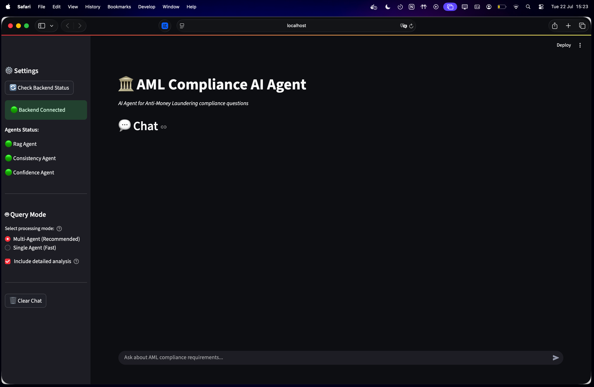

# AML-MultiAgent-RAG

A Multi-Agent RAG platform using Vector DBs and AI agents to answer AML/FT compliance queries with quality validation and consistency checking.

<div align="center">
  
  
  
  
  
  
  
  
  
  

  </div>

## Quick Start

```bash
# Clone and setup
git clone https://github.com/luuisotorres/AML-MultiAgent-RAG.git
cd AML-MultiAgent-RAG
uv sync && source .venv/bin/activate

# Start Qdrant database
docker run -d --name qdrant-aml -p 6333:6333 -p 6334:6334 -v $(pwd)/qdrant_storage:/qdrant/storage qdrant/qdrant

# Run data ingestion pipeline
python3 -m backend.services.document_processing.pdf_processor
python3 -m backend.services.document_processing.text_splitter
python3 -m backend.services.embeddings.openai_embeddings
python3 -m backend.services.vector_db.qdrant_client

# Start API server
python3 -m uvicorn backend.api.main:app --reload --host 0.0.0.0 --port 8000

# In another terminal, start Streamlit app
streamlit run streamlit_app.py
```

- **Streamlit Chat Interface**: [http://localhost:8501](http://localhost:8501)
- **API Documentation**: [http://localhost:8000/docs](http://localhost:8000/docs)
- **Qdrant Dashboard**: [http://localhost:6333/dashboard](http://localhost:6333/dashboard)


## Table of Contents
1. [Core Concepts](#core-concepts)
2. [The AML Use Case](#the-aml-use-case)
3. [Data Ingestion Pipeline](#data-ingestion-pipeline)
4. [RAG System Workflow (Single Agent)](#rag-system-workflow-single-agent)
5. [Multi-Agent Workflow](#multi-agent-workflow)
6. [Streamlit App](#streamlit-app)
7. [Technology Stack](#technology-stack)
8. [Setup and Installation](#setup-and-installation)
9. [Author](#author)

## Core Concepts

### What is a Vector Database?
A **Vector Database** is a specialized database designed to store, manage, and search high-dimensional vectors. In AI, these vectors (also known as *"embeddings"*) are **numerical representations** of data like text, images, or audio.

Instead of searching for exact keywords, a vector database finds items based on their *semantic similarity*. For example, it understands that the phrases "money laundering prevention" and "anti-money laundering compliance" are conceptually related, even though they use different words.

### What is Retrieval-Augmented Generation (RAG)?
**Retrieval-Augmented Generation (RAG)** is an AI framework that enhances Large Language Models (LLMs) by providing them with external, up-to-date, and context-specific information.

Here's how it works:
1.  **Retrieve:** When a user asks a question, the system first searches a knowledge base (like our vector database of AML documents) to find relevant information.
2.  **Augment:** The retrieved information is then added to the user's original prompt.
3.  **Generate:** The LLM receives the augmented prompt (question + relevant context) and generates a context-aware answer.

RAG prevents LLM hallucinations and ensures that answers are grounded in factual, domain-specific data.

## The AML Use Case

### The Challenge in AML/FT Compliance
Financial institutions face a significant challenge in keeping up with regulations related to Anti-Money Laundering and Counter-Financing of Terrorism. These regulations are often complex, vary by jurisdiction (e.g., USA, EU, Brazil), and are spread across numerous lengthy and dense legal documents. Manually searching for specific compliance requirements is slow, error-prone, and requires significant expertise.

### Our Solution
This project builds a RAG system to solve this problem. By converting a library of AML/FT regulations from different regions into a searchable vector database, we can create an AI agent that instantly retrieves the exact clauses and requirements needed to answer complex compliance queries, providing accurate, source-backed answers in seconds. This dramatically improves the efficiency and accuracy of compliance officers.

### Source Documents
The system built here is trained on a collection of AML/FT regulatory documents from **three major jurisdictions**:

#### 🇺🇸 **United States** (English)
- **USA PATRIOT Act** (`PLAW-107publ56.pdf`) - Public Law 107-56, Uniting and Strengthening America
- **Bank Secrecy Act Section 8** (`section8-1.pdf`) - BSA compliance requirements

#### 🇪🇺 **European Union** (English)
- **5th Anti-Money Laundering Directive** (`CELEX:32015L0849:EN:TXT.pdf`) - EU AML Directive 2015/849
- **6th Anti-Money Laundering Directive** (`CELEX:32018L0843:EN:TXT.pdf`) - EU AML Directive 2018/843
- **EU AML Package 2021** (`cellar:05758242-ead6-11eb-93a8-01aa75ed71a1.0001.02/DOC_1.pdf`) - Latest EU AML framework

#### 🇧🇷 **Brazil** (Portuguese)
- **Circular BCB 4001** (`C_Circ_4001_v2_P.pdf`) - Central Bank of Brazil AML/CFT regulations
- **Circular BCB 3978** (`Circ_3978_v3_P.pdf`) - Customer Due Diligence requirements

## Data Ingestion Pipeline

The data ingestion pipeline processes raw regulatory documents and prepares them for the RAG system, building a vector database.


### Process Overview

The pipeline consists of 4 main steps:

1.  **PDF Processing (`pdf_processor.py`):**
    *   Recursively scans the `docs/raw_docs` directory for PDF files.
    *   Extracts raw text content from each PDF.
    *   Detects the document's language (English/Portuguese) and source region (USA/EU/Brazil).
    *   Saves the processed text and metadata to `docs/processed_docs/processed_docs.json`.

2.  **Text Chunking (`text_splitter.py`):**
    *   Loads the processed documents.
    *   Uses a **Recursive Character Text Splitting** strategy to break down large documents into smaller, semantically coherent chunks (e.g., paragraphs, sentences).
    *   This ensures that the meaning and context are preserved for accurate embedding.
    *   Saves the chunked documents to `docs/processed_docs/chunked_docs.json`.

3.  **Embedding Generation (`openai_embeddings.py`):**
    *   Loads the text chunks.
    *   Uses OpenAI's `text-embedding-3-small` model to convert each chunk into a 1536-dimension vector embedding.
    *   Processes chunks in batches to efficiently interact with the OpenAI API.
    *   Saves the documents with their corresponding embeddings to `docs/embeddings/embedded_docs.json`.

4.  **Vector DB Storage (`qdrant_client.py`):**
    *   Loads the embedded documents.
    *   Connects to the **Qdrant** vector database.
    *   Creates a collection named `aml-documents`.
    *   Uploads (upserts) the vector embeddings along with their metadata (filename, language, source region, etc.) into the collection.

### Running the Pipeline

Execute the following scripts in order from the project root directory:

```bash
# Step 1: Process PDFs
python3 -m backend.services.document_processing.pdf_processor

# Step 2: Chunk Documents  
python3 -m backend.services.document_processing.text_splitter

# Step 3: Generate Embeddings
python3 -m backend.services.embeddings.openai_embeddings

# Step 4: Store in Vector Database
python3 -m backend.services.vector_db.qdrant_client
```

### Vector Database Results

Once the pipeline is complete, you can visualize your populated vector database through the Qdrant dashboard:


*The Qdrant dashboard showing our `aml-documents` collection with embedded content*


*Detailed view of the AML documents collection with vector embeddings and metadata*


*Vector space visualization showing the semantic relationships between different document chunks*

---

## RAG System Workflow (Single Agent)

The single agent workflow provides fast responses for AML compliance queries. This **RAG Agent** focuses solely on providing context-aware answers for user's queries, without the additional evaluations from other agents. 


### Workflow Process

1. **Query Reception & Language Detection**: Analyze incoming query to determine language (Portuguese/English)
2. **Embedding Generation**: Convert query text into vector representation using OpenAI embeddings
3. **Vector Search**: Perform semantic similarity search in Qdrant to find relevant document chunks
4. **Context Preparation**: Extract and format retrieved documents with metadata (filename, jurisdiction, language)
5. **Answer Generation**: Use GPT-4 with language-appropriate system prompts and retrieved context
6. **Response Enhancement**: Add source citations, confidence scores, and jurisdiction identification
7. **API Response**: Format and return structured response with answer, sources, and metadata

### Live API Documentation

The system provides a FastAPI-based REST API with automatic documentation via Swagger UI:


*Interactive API documentation for testing queries in real-time*

#### API Endpoints

- **`POST /api/v1/query`** - Submit AML compliance questions (Single Agent)
- **`GET /api/v1/health`** - Check system health and agent status  
- **`GET /api/v1/info`** - Get API capabilities and documentation

### Query Example


*Example single agent response showing source attribution, confidence scoring, and jurisdiction identification*

## Multi-Agent Workflow

The Multi-Agent system provides advanced quality validation and consistency checking through **specialized agents working in coordination** to evaluate responses provided by the **RAG Agent**.


### Agent Architecture

#### **RAG Agent**
The primary retrieval and generation agent that:
- Performs semantic search across the vector database
- Generates initial responses using retrieved context
- Provides source citations and basic metadata
- Serves as the foundation for all other agent analysis

#### **Confidence Agent**
Specialized agent for confidence assessment that:
- Analyzes response certainty and reliability
- Evaluates source relevance and answer specificity
- Generates confidence scores (0-100%) and levels (High/Medium/Low)
- Identifies uncertainty indicators and hedging language

#### **Consistency Agent**
Quality validation agent that ensures:
- Cross-agent response agreement and reliability
- Alignment with source documents without contradictions
- Jurisdictional coherence and regulatory consistency
- Generates consistency scores and status indicators

#### **Orchestrator**
Coordination layer that:
- Manages agent interactions and data flow
- Implements quality gates and validation logic
- Combines individual agent outputs into unified responses
- Ensures response completeness and quality standards

### Multi-Agent API Route

The `/api/v1/multi-agent/query` endpoint processes AML compliance queries with additional validation from specialized agents.


*Multi-agent endpoint configuration with detailed analysis options*

### Multi-Agent Response Example


*Example multi-agent response showing detailed quality metrics, consistency validation, and confidence analysis*

### Sample Queries

**English Queries:**
```
"What are the customer identification program (CIP) requirements under the USA PATRIOT Act?"
"How do enhanced due diligence measures differ between US and EU regulations?"
"What are the reporting thresholds for suspicious activity reports in different jurisdictions?"
```

**Portuguese Queries:**
```
"Quais são os procedimentos de conhecimento do cliente exigidos pelo Banco Central do Brasil?"
"O que estabelece a Circular 4001 sobre clientes de alto risco?"
"Como funcionam os controles de prevenção à lavagem de dinheiro no Brasil?"
```

## Streamlit App

This system also comes with a user-friendly chat interface built with **Streamlit** that provides an intuitive way to interact with both single and multi-agent systems.



*Main chat interface with agent selection and real-time status monitoring*

### Key Features

#### **Agent Mode Selection**


*Single Agent mode for fast, straightforward responses*


*Multi-Agent mode with quality validation*

#### **Source Attribution**


*Expandable sources section with detailed document citations and metadata*

#### **Quality Metrics Display**


*Quality Gates showing consistency, confidence, and overall validation status*

#### **Raw Response Data**


*Complete response data for debugging and analysis*

> The interface offers real-time health checks and connectivity status with the API server. It also provides explanations for metrics and indicators, as welll as chat history and perofrmance monitoring for each query. 

## Technology Stack

### **Core Technologies**
- **Programming Language:** Python 3.11+
- **Vector Database:** [Qdrant](https://qdrant.tech/)
- **AI/LLM Frameworks:** LangChain, OpenAI GPT-4
- **API Framework:** FastAPI
- **Frontend:** Streamlit for interactive chat interface
- **Containerization:** Docker for database deployment
- **Package Management:** [uv](https://github.com/astral-sh/uv)

### **AI & ML Stack**
- **Language Models:** OpenAI GPT-4 for response generation
- **Embeddings:** OpenAI text-embedding-3-small (1536 dimensions)
- **Vector Search:** Semantic similarity with cosine distance
- **Text Processing:** LangChain text splitters and document loaders

### **Data & Infrastructure**
- **Database:** Qdrant vector database
- **Document Processing:** PyPDF2 for PDF text extraction
- **API Documentation:** Automatic Swagger UI generation

## Setup and Installation

### Prerequisites
- **Python** >= 3.11
- **Docker Desktop** (for Qdrant database)
- **OpenAI API Key** (for embeddings and language models)

### Installation Steps

#### 1. Clone the Repository
```bash
git clone https://github.com/luuisotorres/AML-MultiAgent-RAG.git
cd AML-MultiAgent-RAG
```

#### 2. Install uv Package Manager
```bash
# On macOS/Linux
curl -LsSf https://astral.sh/uv/install.sh | sh

# Or using Homebrew on macOS
brew install uv

# Or using pip
pip install uv
```

#### 3. Create Virtual Environment with uv
```bash
# Create virtual environment and install exact dependency versions from lock file
uv sync

# Activate virtual environment
source .venv/bin/activate  # On macOS/Linux
# .venv\Scripts\activate   # On Windows
```

> **Note:** The `uv sync` command reads the `uv.lock` file to install exact versions of all dependencies, ensuring reproducible builds across different environments.

#### 4. Set up Environment Variables
```bash
# Copy the example environment file
cp .env.example .env
```

Edit the `.env` file and add your OpenAI API key:
```env
OPENAI_API_KEY="your_openai_api_key_here"
```

#### 5. Docker Setup for Qdrant
Start the Qdrant vector database:
```bash
docker run -d \
  --name qdrant-aml \
  -p 6333:6333 \
  -p 6334:6334 \
  -v $(pwd)/qdrant_storage:/qdrant/storage \
  qdrant/qdrant
```

**Access Qdrant Web UI:** [http://localhost:6333/dashboard](http://localhost:6333/dashboard)

#### 6. Run Data Ingestion Pipeline
Process documents and build the vector database:
```bash
python3 -m backend.services.document_processing.pdf_processor
python3 -m backend.services.document_processing.text_splitter  
python3 -m backend.services.embeddings.openai_embeddings
python3 -m backend.services.vector_db.qdrant_client
```

#### 7. Start the FastAPI Server
```bash
# Start the API server with multi-agent capabilities
python3 -m uvicorn backend.api.main:app --reload --host 0.0.0.0 --port 8000
```

#### 8. Launch Streamlit App
In another terminal:
```bash
# Activate virtual environment
source .venv/bin/activate

# Start Streamlit interface
streamlit run streamlit_app.py
```

### Access Links
- **Streamlit Chat Interface**: [http://localhost:8501](http://localhost:8501)
- **API Documentation (Swagger UI)**: [http://localhost:8000/docs](http://localhost:8000/docs)
- **Qdrant Dashboard**: [http://localhost:6333/dashboard](http://localhost:6333/dashboard)

## Author

[Luis Fernando Torres](https://github.com/luuisotorres)

[](https://www.linkedin.com/in/luuisotorres/)
[](https://medium.com/@luuisotorres)
[](https://www.kaggle.com/lusfernandotorres)
[](https://huggingface.co/luisotorres)


## License

This project is licensed under the MIT License. See the [LICENSE](LICENSE) file for details.