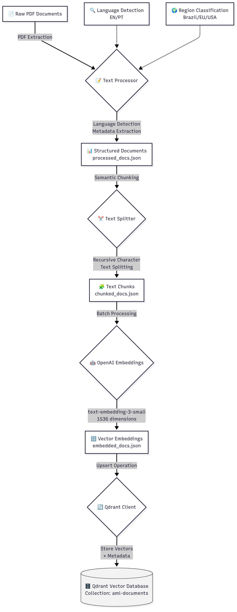

# AML-MultiAgent-RAG
A Multi-Agent RAG platform using Vector DBs and AI models to accurately answer AML/FT compliance queries.
<div align="center">
  
  
  
  
  
  
  
  
  


</div>

<div align="center">
  
</div>


## Table of Contents
1. [Core Concepts](#core-concepts)
2. [The AML Use Case](#the-aml-use-case)
3. [Workflow](#workflow)
4. [Technology Stack](#technology-stack)
5. [Setup and Installation](#setup-and-installation)
6. [Running the Pipeline](#running-the-pipeline)

## Core Concepts

### What is a Vector Database?
A **Vector Database** is a specialized database designed to store, manage, and search high-dimensional vectors. In the context of AI, these vectors (also known as *"embeddings"*) are **numerical representations** of data like text, images, or audio.

Instead of searching for exact keywords, a vector database finds items based on their *semantic similarity*. For example, it understands that the phrases "money laundering prevention" and "anti-money laundering compliance" are conceptually related, even though they use different words.

### What is Retrieval-Augmented Generation (RAG)?
**Retrieval-Augmented Generation (RAG)** is an AI framework that enhances Large Language Models (LLMs) by providing them with external, up-to-date, and context-specific information.

Here's how it works:
1.  **Retrieve:** When a user asks a question, the system first searches a knowledge base (like our vector database of AML documents) to find relevant information.
2.  **Augment:** The retrieved information is then added to the user's original prompt.
3.  **Generate:** The LLM receives the augmented prompt (question + relevant context) and generates a context-aware answer.

RAG prevents LLM hallucinations and ensures that answers are grounded in factual, domain-specific data.

## The AML Use Case

### The Challenge in AML/FT Compliance
Financial institutions face a significant challenge in keeping up with Anti-Money Laundering (AML) and Counter-Financing of Terrorism (FT) regulations. These regulations are complex, vary by jurisdiction (e.g., USA, EU, Brazil), and are spread across numerous lengthy, dense legal documents. Manually searching for specific compliance requirements is slow, error-prone, and requires significant expertise.

### Our Solution
This project builds a RAG system to solve this problem. By converting a library of AML/FT regulations from different regions into a searchable vector database, we can create an AI agent that instantly retrieves the exact clauses and requirements needed to answer complex compliance queries, providing accurate, source-backed answers in seconds. This dramatically improves the efficiency and accuracy of compliance officers.

### Source Documents
The system is trained on a collection of AML/FT regulatory documents from **three major jurisdictions**:

#### 🇺🇸 **United States** (English)
- **USA PATRIOT Act** (`PLAW-107publ56.pdf`) - Public Law 107-56, Uniting and Strengthening America
- **Bank Secrecy Act Section 8** (`section8-1.pdf`) - BSA compliance requirements

#### 🇪🇺 **European Union** (English)
- **5th Anti-Money Laundering Directive** (`CELEX:32015L0849:EN:TXT.pdf`) - EU AML Directive 2015/849
- **6th Anti-Money Laundering Directive** (`CELEX:32018L0843:EN:TXT.pdf`) - EU AML Directive 2018/843
- **EU AML Package 2021** (`cellar:05758242-ead6-11eb-93a8-01aa75ed71a1.0001.02/DOC_1.pdf`) - Latest EU AML framework

#### 🇧🇷 **Brazil** (Portuguese)
- **Circular BCB 4001** (`C_Circ_4001_v2_P.pdf`) - Central Bank of Brazil AML/CFT regulations
- **Circular BCB 3978** (`Circ_3978_v3_P.pdf`) - Customer Due Diligence requirements

## Workflow

The core of this project is a data ingestion pipeline that processes raw regulatory documents and prepares them for the RAG system.



1.  **PDF Processing (`pdf_processor.py`):**
    *   Recursively scans the `docs/raw_docs` directory for PDF files.
    *   Extracts raw text content from each PDF.
    *   Detects the document's language (English/Portuguese) and source region (USA/EU/Brazil).
    *   Saves the processed text and metadata to `docs/processed_docs/processed_docs.json`.

2.  **Text Chunking (`text_splitter.py`):**
    *   Loads the processed documents.
    *   Uses a **Recursive Character Text Splitting** strategy to break down large documents into smaller, semantically coherent chunks (e.g., paragraphs, sentences).
    *   This ensures that the meaning and context are preserved for accurate embedding.
    *   Saves the chunked documents to `docs/processed_docs/chunked_docs.json`.

3.  **Embedding Generation (`openai_embeddings.py`):**
    *   Loads the text chunks.
    *   Uses OpenAI's `text-embedding-3-small` model to convert each chunk into a 1536-dimension vector embedding.
    *   Processes chunks in batches to efficiently interact with the OpenAI API.
    *   Saves the documents with their corresponding embeddings to `docs/processed_docs/embedded_docs.json`.

4.  **Vector DB Storage (`qdrant_client.py`):**
    *   Loads the embedded documents.
    *   Connects to the **Qdrant** vector database.
    *   Creates a collection named `aml-documents`.
    *   Uploads (upserts) the vector embeddings along with their metadata (filename, language, source region, etc.) into the collection.

## Technology Stack
*   **Programming Language:** Python 3.11+
*   **Vector Database:** [Qdrant](https://qdrant.tech/)
*   **AI/LLM Frameworks:** LangChain, OpenAI
*   **Containerization:** Docker
*   **Package Management:** uv

## Setup and Installation

### Prerequisites
*   Python >= 3.11
*   Docker Desktop
*   An OpenAI API Key

### Installation Steps
1.  **Clone the repository:**
    ```bash
    git clone https://github.com/luuisotorres/AML-MultiAgent-RAG.git
    cd AML-MultiAgent-RAG
    ```

2.  **Install uv (if not already installed):**
    ```bash
    # On macOS/Linux
    curl -LsSf https://astral.sh/uv/install.sh | sh
    
    # Or using Homebrew on macOS
    brew install uv
    ```

3.  **Create virtual environment and install dependencies:**
    ```bash
    # Create virtual environment and install exact dependency versions from lock file
    uv sync
    
    # Activate virtual environment
    source .venv/bin/activate  # On macOS/Linux
    # .venv\Scripts\activate   # On Windows
    ```
    
    > **Note:** The `uv sync` command reads the `uv.lock` file to install exact versions of all dependencies, ensuring reproducible builds across different environments.

4.  **Set up your environment variables:**
    ```bash
    # Copy the example environment file
    cp .env.example .env
    ```
    
    Then edit the `.env` file and add your OpenAI API key:
    ```env
    OPENAI_API_KEY="your_openai_api_key_here"
    ```

### Docker Setup for Qdrant
We use Docker to run the Qdrant vector database because it provides a consistent, isolated, and easy-to-manage environment.

1.  **Start the Qdrant Container:**
    This command will download the Qdrant image and start the database server. Your data will be persisted in a `qdrant_storage` folder in your project directory.
    ```bash
    docker run -d \
      --name qdrant-aml \
      -p 6333:6333 \
      -p 6334:6334 \
      -v $(pwd)/qdrant_storage:/qdrant/storage \
      qdrant/qdrant
    ```

2.  **Access the Qdrant Web UI:**
    You can explore your vector database through a graphical interface by navigating to the following URL in your browser:
    *   **URL:** [http://localhost:6333/dashboard](http://localhost:6333/dashboard)

## Running the Pipeline
Execute the following scripts in order from the project root directory to process your documents and populate the vector database.

1.  **Process PDFs:**
    ```bash
    python3 -m backend.services.document_processing.pdf_processor
    ```

2.  **Chunk Documents:**
    ```bash
    python3 -m backend.services.document_processing.text_splitter
    ```

3.  **Generate Embeddings:**
    ```bash
    python3 -m backend.services.embeddings.openai_embeddings
    ```

4.  **Store in Vector Database:**
    ```bash
    python3 -m backend.services.vector_db.qdrant_client
    ```

After completing these steps, your vector database will be populated and ready for the next phase: building the agentic layer to query the data.


## Author

[Luis Fernando Torres](https://github.com/luuisotorres)

[](https://www.linkedin.com/in/luuisotorres/)
[](https://medium.com/@luuisotorres)
[](https://www.kaggle.com/lusfernandotorres)
[](https://huggingface.co/luisotorres)


## License

This project is licensed under the MIT License. See the [LICENSE](LICENSE) file for details.